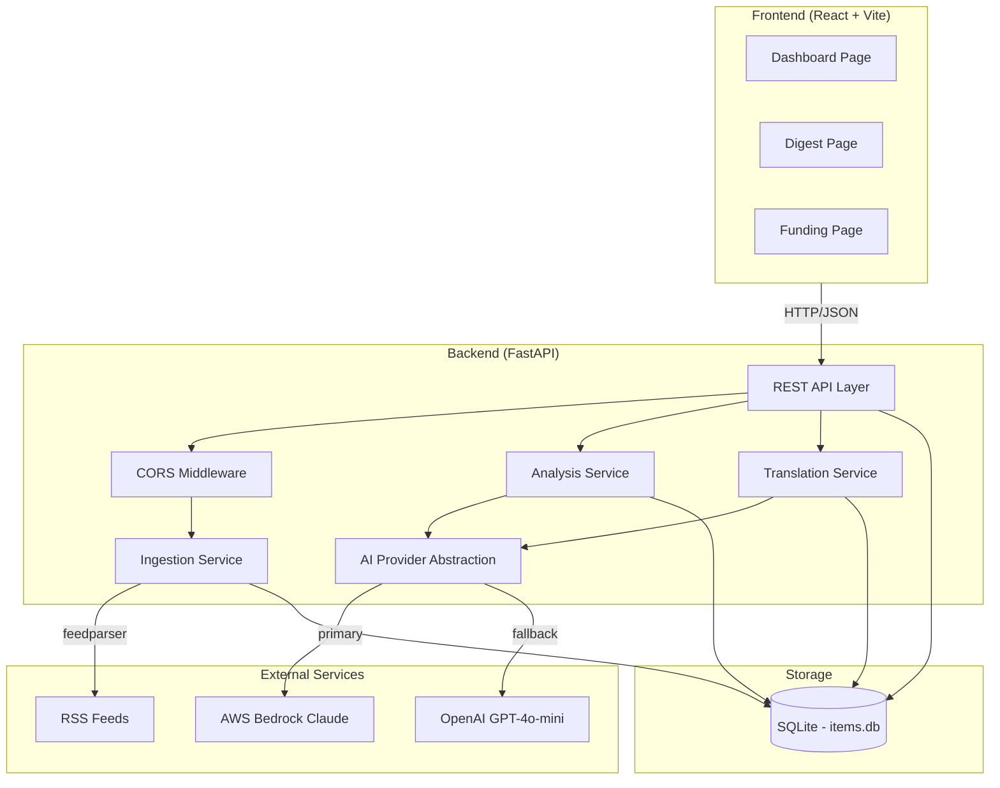
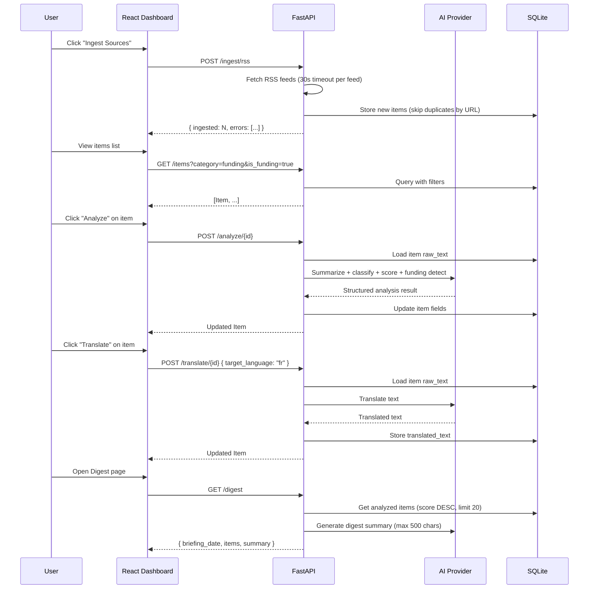

# Design Document: NGO Intelligence Dashboard (Hackathon MVP)

## Overview

The NGO Intelligence Dashboard is a lightweight AI-powered web app built in 2 days for the AI 4 Good Hackathon. It aggregates news and funding opportunities for two partner NGOs (Burundi Kids and WTG), provides AI-driven analysis (summarization, classification, relevance scoring), and offers translation between English, French, and German.

**Design Priorities:**
- Ship a working demo in 2 days
- Minimal infrastructure — single process, SQLite, no auth
- AI-powered analysis via Bedrock Claude (primary) or OpenAI (fallback)
- RSS-based ingestion with graceful per-feed error handling
- Clear demo flow for judges

**Tech Stack:**
- **Frontend:** React + Vite (TypeScript)
- **Backend:** Python 3.11+, FastAPI
- **Database:** SQLite (single file, zero config)
- **AI Provider:** AWS Bedrock Claude (primary), OpenAI GPT-4o-mini (fallback)
- **Ingestion:** RSS feeds (feedparser) + manual seed data

## Architecture



### Request Flow



## Components and Interfaces

### Backend API Endpoints

#### POST /ingest/rss — Ingest RSS feeds

**Request:**
```json
{
  "feeds": ["https://reliefweb.int/updates/rss.xml", "https://www.devex.com/news/rss"]
}
```
- `feeds` is optional. If omitted or empty, uses default feed list.
- Maximum 20 URLs accepted.

**Response (200):**
```json
{
  "ingested": 12,
  "errors": [
    { "feed_url": "https://bad-feed.example.com/rss", "error": "Connection timeout after 30s" }
  ]
}
```

**Error cases:**
- Individual feed failures do not fail the request — they are reported in `errors` array.
- Feed entries missing `title` or `url` are silently skipped.
- Duplicate URLs (already in DB) are skipped without error.
- If ALL feeds fail (zero items ingested), still returns HTTP 200 with `ingested: 0` and `errors` populated.
- More than 20 feed URLs → HTTP 400.

---

#### GET /items — List items with optional filters

**Query Parameters:**
| Param | Type | Description |
|-------|------|-------------|
| `category` | string | Filter by category (case-insensitive match) |
| `is_funding` | boolean | Filter by funding opportunity flag ("true"/"false" only) |

**Response (200):**
```json
[
  {
    "id": 1,
    "title": "EU Grant for East African Education",
    "url": "https://example.com/article",
    "source": "reliefweb.int",
    "published_at": "2025-01-15T10:00:00Z",
    "language": "en",
    "raw_text": "The European Union has announced...",
    "summary": "EU announces €50M education grant for East Africa.",
    "category": "funding",
    "relevance_score": 0.87,
    "is_funding_opportunity": true,
    "deadline": "2025-03-15",
    "translated_text": null,
    "created_at": "2025-01-16T08:30:00Z"
  }
]
```
- Always returns 200 (empty list if no items match).
- Ordered by `created_at` descending (newest first).
- When both filters are provided, they combine with AND logic.
- If `is_funding` parameter is not parseable as boolean (not "true"/"false" case-insensitive), returns HTTP 422.

---

#### POST /analyze/{id} — AI analysis of an item

**Response (200):**
```json
{
  "id": 1,
  "title": "EU Grant for East African Education",
  "summary": "EU announces €50M education grant targeting East African countries.",
  "category": "funding",
  "relevance_score": 0.87,
  "is_funding_opportunity": true,
  "deadline": "2025-03-15",
  "...": "full Item fields"
}
```

**Constraints:**
- `summary`: max 200 characters
- `category`: one of `"news"`, `"funding"`, `"policy"`, `"research"`, `"other"`
- `relevance_score`: float in [0.0, 1.0], computed as `0.7 * ai_score + 0.3 * keyword_score`
- `is_funding_opportunity`: boolean, always set after analysis
- `deadline`: extracted date string if funding, otherwise null; non-funding items always get `deadline: null`
- Re-analysis of an already-analyzed item overwrites all previous analysis fields

**Error responses:**
- 400: Item has null or whitespace-only raw_text (no text available for analysis)
- 404: Item not found
- 503: AI service temporarily unavailable (both providers failed)

---

#### POST /translate/{id} — Translate item text

**Request:**
```json
{
  "target_language": "fr"
}
```
- `target_language` must be one of: `"en"`, `"fr"`, `"de"`

**Response (200):** Full Item with `translated_text` populated.

**Error responses:**
- 400: Invalid target language, or item has null/whitespace-only raw_text
- 404: Item not found
- 422: Missing `target_language` field or request body is not valid JSON
- 503: Translation service unavailable (both AI providers failed)

---

#### GET /digest — Curated NGO briefing

**Response (200):**
```json
{
  "briefing_date": "2025-01-16",
  "summary": "Key themes include new EU education funding for East Africa and wildlife conservation policy updates...",
  "items": [
    { "id": 1, "title": "...", "relevance_score": 0.92, "...": "full Item" }
  ]
}
```

**Constraints:**
- Only items with non-null `summary`, `category`, AND `relevance_score` are included
- Items sorted by `relevance_score` descending, with ties broken by `created_at` descending
- Maximum 20 items returned
- `summary` field: AI-generated, max 500 characters, highlights key themes
- `briefing_date`: ISO 8601 date string (current date)
- If no analyzed items exist, returns empty `items` list with a summary indicating no data

---

#### GET /funding — Funding opportunities

**Response (200):**
```json
[
  {
    "id": 3,
    "title": "USAID Grant for Animal Welfare Programs",
    "source": "devex.com",
    "deadline": "2025-04-01",
    "relevance_score": 0.75,
    "...": "full Item"
  }
]
```

**Constraints:**
- Only items where `is_funding_opportunity` is true
- Sorted by `deadline` ascending (items with null deadline appear last)
- Returns empty array if no funding items exist

---

#### Frontend Behavior: Funding Page

- Show loading indicator while GET /funding is in progress
- Display each funding Item with: title, source, deadline (locale-formatted or "No deadline"), relevance_score (or "Not analyzed")
- Empty state: "No funding opportunities currently available"
- API error: "Funding data could not be loaded"

---

#### GET /health — Health check

**Response (200):**
```json
{
  "status": "ok",
  "ai_provider": "bedrock",
  "db": "connected"
}
```

**Logic:**
- `ai_provider`: Check Bedrock first (timeout ≤ 3s), then OpenAI (timeout ≤ 3s): `"bedrock"` if reachable, else `"openai"` if reachable, else `"none"`
- `db`: `"connected"` if SQLite test query succeeds, else `"disconnected"`
- Must respond within 5 seconds total
- If combined checks exceed 5 seconds, return partial results: set unchecked `ai_provider` to `"none"`, unchecked `db` to `"disconnected"`

---

### Service Layer Design

```python
# ai_provider.py — AI abstraction with failover
class AIProvider:
    """Routes requests to Bedrock Claude (primary) or OpenAI (fallback)."""

    CONNECTION_TIMEOUT = 8  # seconds before failover to fallback

    def invoke(self, prompt: str, system: str = "") -> str:
        """Send prompt to active AI provider. Raises AIUnavailableError if both fail.
        Bedrock attempt times out after 8 seconds before triggering fallback."""
        try:
            return self._call_bedrock(prompt, system)
        except (BedrockUnavailableError, TimeoutError):
            return self._call_openai(prompt, system)

    def get_active_provider(self) -> str:
        """Returns 'bedrock', 'openai', or 'none'. Checks Bedrock (≤3s timeout), then OpenAI (≤3s timeout)."""
        ...
```

```python
# ingest_service.py
class IngestService:
    DEFAULT_FEEDS = [
        "https://reliefweb.int/updates/rss.xml",
        "https://www.devex.com/news/rss",
        "https://feeds.bbci.co.uk/news/world/africa/rss.xml",
    ]

    def ingest(self, feed_urls: list[str] | None = None) -> IngestResult:
        """
        Fetch and parse RSS feeds. Store new items, skip duplicates.
        - Uses DEFAULT_FEEDS if feed_urls is None or empty.
        - 30-second timeout per feed.
        - Skips entries missing title or URL.
        - Skips entries whose URL already exists in DB.
        Returns IngestResult(ingested=int, errors=[ErrorDetail]).
        """
        ...
```

```python
# analysis_service.py
class AnalysisService:
    VALID_CATEGORIES = {"news", "funding", "policy", "research", "other"}

    def analyze_item(self, item_id: int) -> Item:
        """
        Full AI analysis pipeline:
        1. Validate item exists and has non-null/non-whitespace raw_text (else 400)
        2. Generate summary (max 200 chars)
        3. Classify category (from VALID_CATEGORIES)
        4. Compute relevance_score (hybrid: 70% AI + 30% keyword)
        5. Detect funding opportunity (boolean)
        6. Extract deadline if funding; set deadline=null if not funding
        7. Re-analysis overwrites all previously stored analysis fields
        Returns updated Item. Raises ItemNotFoundError, ValidationError, or AIUnavailableError.
        """
        ...

    def compute_relevance(self, text: str, title: str) -> float:
        """
        Hybrid scoring: 0.7 * ai_score + 0.3 * keyword_score.
        keyword_score = min(1.0, keyword_matches / 5).
        Falls back to keyword-only if AI scoring fails.
        """
        ...
```

```python
# translation_service.py
class TranslationService:
    SUPPORTED_LANGUAGES = {"en", "fr", "de"}

    def translate(self, item_id: int, target_language: str) -> Item:
        """
        Translate item's raw_text to target language.
        - Validates target_language is in SUPPORTED_LANGUAGES (else 400).
        - Validates item exists (else 404) and raw_text is non-empty/non-whitespace (else 400).
        - Missing target_language field or invalid JSON body → 422.
        - Stores result in translated_text (overwrites previous).
        - Does NOT modify raw_text.
        - Performs translation even if target matches detected language.
        Returns updated Item.
        Raises: ItemNotFoundError, ValidationError, AIUnavailableError.
        """
        ...
```

### Relevance Scoring Algorithm

```python
TARGET_KEYWORDS = [
    "burundi", "bujumbura", "gitega", "gateri",
    "great lakes", "east africa",
    "education", "gbv", "gender-based violence",
    "health", "animal welfare", "wildlife",
    "funding", "grants", "ngo", "ngos",
    "development cooperation", "humanitarian",
]

def compute_relevance(text: str, title: str, ai_provider: AIProvider) -> float:
    """
    Hybrid relevance scoring:
    - keyword_score = min(1.0, count_of_keyword_matches / 5)
    - ai_score = AI-rated relevance (0.0-1.0)
    - final_score = 0.7 * ai_score + 0.3 * keyword_score
    - Falls back to keyword_score alone if AI scoring fails.
    """
    combined = (title + " " + text).lower()
    matches = sum(1 for kw in TARGET_KEYWORDS if kw in combined)
    keyword_score = min(1.0, matches / 5)

    try:
        ai_response = ai_provider.invoke(
            prompt=f"Rate relevance 0.0-1.0 for NGOs focused on education/child welfare "
                   f"in Burundi or animal welfare globally.\n"
                   f"Title: {title}\nText: {text[:500]}\n"
                   f"Reply with only a decimal number.",
            system="You are a relevance scoring assistant. Reply with only a float 0.0-1.0."
        )
        ai_score = max(0.0, min(1.0, float(ai_response.strip())))
        return round(0.7 * ai_score + 0.3 * keyword_score, 4)
    except Exception:
        return keyword_score
```

### Frontend Pages

```typescript
// Three pages for MVP
DashboardPage    — Item list with filters, "Ingest" button, per-item Analyze/Translate
DigestPage       — NGO briefing: AI summary + top relevant items
FundingPage      — Funding opportunities with deadlines, loading indicator on load

// Shared components
ItemCard         — Title, source, category badge, relevance score, funding indicator
AnalyzeButton    — POST /analyze/{id}, loading spinner, updates item on success, shows inline error on failure
TranslateButton  — Language picker (en/fr/de), POST /translate/{id}, loading state, shows inline error on failure
IngestButton     — POST /ingest/rss, shows count ingested + any errors
ErrorMessage     — Inline error display, cleared on retry or success
LoadingIndicator — Spinner/skeleton shown during API calls
```

### CORS Configuration

```python
# CORS middleware setup in main.py
from fastapi.middleware.cors import CORSMiddleware
import os

ALLOWED_ORIGINS = [
    "http://localhost:5173",  # Default Vite dev server
]

# Additional origins from environment variable (comma-separated)
extra_origins = os.environ.get("CORS_ORIGINS", "")
if extra_origins:
    ALLOWED_ORIGINS.extend([o.strip() for o in extra_origins.split(",") if o.strip()])

app.add_middleware(
    CORSMiddleware,
    allow_origins=ALLOWED_ORIGINS,
    allow_methods=["GET", "POST", "OPTIONS"],
    allow_headers=["Content-Type"],
)
```

**CORS Rules:**
- Allow origin: `http://localhost:5173` (hardcoded) + additional origins via `CORS_ORIGINS` env variable
- Allow methods: GET, POST, OPTIONS
- Allow headers: Content-Type
- Preflight OPTIONS requests return HTTP 200 with appropriate CORS headers

## Data Models

### Item Model (Pydantic + SQLite)

```python
from pydantic import BaseModel, Field
from typing import Optional
from datetime import datetime

class Item(BaseModel):
    id: int
    title: str
    url: str
    source: str                              # RSS feed domain or "manual"
    published_at: Optional[datetime] = None
    language: Optional[str] = None           # ISO 639-1: "en", "fr", "de", or "unknown"
    raw_text: str                            # original article text (never modified after creation)
    summary: Optional[str] = None            # AI summary, max 200 chars
    category: Optional[str] = None           # "news"|"funding"|"policy"|"research"|"other"
    relevance_score: Optional[float] = None  # 0.0-1.0, null if not analyzed
    is_funding_opportunity: bool = False     # AI-detected funding flag
    deadline: Optional[str] = None           # extracted deadline date (ISO format) if funding
    translated_text: Optional[str] = None    # latest translation result
    created_at: datetime

class IngestRequest(BaseModel):
    feeds: Optional[list[str]] = None        # max 20 URLs; None = use defaults

class IngestResult(BaseModel):
    ingested: int
    errors: list[dict]                       # [{"feed_url": str, "error": str}]

class TranslateRequest(BaseModel):
    target_language: str                     # "en" | "fr" | "de"

class DigestResponse(BaseModel):
    briefing_date: str                       # ISO 8601 date
    summary: str                             # AI-generated, max 500 chars
    items: list[Item]                        # max 20, sorted by relevance_score desc
```

### SQLite Schema

```sql
CREATE TABLE items (
    id INTEGER PRIMARY KEY AUTOINCREMENT,
    title TEXT NOT NULL,
    url TEXT NOT NULL UNIQUE,
    source TEXT NOT NULL,
    published_at TIMESTAMP,
    language TEXT,
    raw_text TEXT NOT NULL,
    summary TEXT,
    category TEXT CHECK(category IS NULL OR category IN ('news', 'funding', 'policy', 'research', 'other')),
    relevance_score REAL CHECK(relevance_score IS NULL OR (relevance_score >= 0.0 AND relevance_score <= 1.0)),
    is_funding_opportunity BOOLEAN DEFAULT 0,
    deadline TEXT,
    translated_text TEXT,
    created_at TIMESTAMP DEFAULT CURRENT_TIMESTAMP
);

-- Performance indexes
CREATE UNIQUE INDEX idx_items_url ON items(url);
CREATE INDEX idx_items_relevance ON items(relevance_score DESC);
CREATE INDEX idx_items_funding ON items(is_funding_opportunity) WHERE is_funding_opportunity = 1;
CREATE INDEX idx_items_category ON items(category);
CREATE INDEX idx_items_created ON items(created_at DESC);
```

The UNIQUE constraint on `url` enforces deduplication at the database level (Requirement 1.4).
The CHECK constraints enforce data integrity at the database level (Requirements 11.3, 11.4).

### Default RSS Feeds

```python
DEFAULT_RSS_FEEDS = [
    "https://reliefweb.int/updates/rss.xml",
    "https://www.devex.com/news/rss",
    "https://feeds.bbci.co.uk/news/world/africa/rss.xml",
]
```

## Correctness Properties

*A property is a characteristic or behavior that should hold true across all valid executions of a system — essentially, a formal statement about what the system should do. Properties serve as the bridge between human-readable specifications and machine-verifiable correctness guarantees.*

### Property 1: Ingestion stores items with all required fields

*For any* valid RSS feed entry that has both a title and a URL, after ingestion the stored Item SHALL have non-null values for title, url, source, and raw_text, and SHALL have a language field set to a valid ISO 639-1 code or "unknown".

**Validates: Requirements 1.3, 1.7**

### Property 2: Ingestion deduplication by URL

*For any* Item URL already present in the database, re-ingesting a feed containing that URL SHALL NOT increase the total item count in the database.

**Validates: Requirements 1.4**

### Property 3: Analysis output validity

*For any* Item that is successfully analyzed, the resulting Item SHALL have: a non-null summary of at most 200 characters, a category that is exactly one of {"news", "funding", "policy", "research", "other"}, a relevance_score that is a float in [0.0, 1.0], and is_funding_opportunity set to either true or false (never null).

**Validates: Requirements 2.1, 2.2, 2.3, 2.4, 2.8**

### Property 4: Keyword scoring formula

*For any* text string, the keyword_score component SHALL equal min(1.0, number_of_TARGET_KEYWORDS_found_in_text / 5). Specifically: text containing 0 keywords produces 0.0, text containing exactly 5 or more keywords produces 1.0.

**Validates: Requirements 2.3**

### Property 5: Translation is non-destructive

*For any* Item that is translated, the original raw_text field SHALL remain unchanged after translation, and the translated_text field SHALL be a non-null, non-empty string.

**Validates: Requirements 3.1, 3.3**

### Property 6: Invalid translation inputs rejected

*For any* target_language string not in {"en", "fr", "de"}, the translate endpoint SHALL return a 400 error. *For any* Item whose raw_text is null or contains only whitespace characters, the translate endpoint SHALL return a 400 error. *For any* request body missing the target_language field or containing invalid JSON, the translate endpoint SHALL return a 422 error.

**Validates: Requirements 3.4, 3.5, 3.9**

### Property 7: Items listing sort order

*For any* response from GET /items (with or without filters), the returned items SHALL be ordered by created_at descending — i.e., for consecutive items i and i+1 in the list, items[i].created_at >= items[i+1].created_at.

**Validates: Requirements 4.1**

### Property 8: Filter correctness

*For any* combination of category and is_funding filter parameters applied to GET /items, every item in the response SHALL match ALL specified filter conditions. If category is specified, item.category SHALL match (case-insensitive). If is_funding is specified, item.is_funding_opportunity SHALL match the boolean value.

**Validates: Requirements 4.2, 4.3, 4.4**

### Property 9: Digest completeness and ordering

*For any* response from GET /digest: (a) every item SHALL have non-null summary, category, and relevance_score; (b) items SHALL be sorted by relevance_score descending, with ties broken by created_at descending; (c) at most 20 items SHALL be returned; (d) the summary field SHALL be at most 500 characters.

**Validates: Requirements 5.1, 5.2, 5.3, 5.4**

### Property 10: Funding endpoint filter and sort

*For any* response from GET /funding: (a) every item SHALL have is_funding_opportunity equal to true; (b) items SHALL be sorted by deadline ascending, with items having null deadline appearing after items with non-null deadlines.

**Validates: Requirements 6.1**

### Property 11: Relevance score bounds invariant

*For any* item in the database, the relevance_score field SHALL be either null (not yet analyzed) or a float value satisfying 0.0 ≤ relevance_score ≤ 1.0.

**Validates: Requirements 2.3, 11.3**

### Property 12: All-feeds-fail graceful response

*For any* POST /ingest/rss request where all provided feeds are unreachable or invalid, the endpoint SHALL still return HTTP 200 with `ingested` equal to 0 and the `errors` array containing one entry per failed feed.

**Validates: Requirements 1.9**

### Property 13: Non-funding items have null deadline

*For any* Item where is_funding_opportunity is false, the deadline field SHALL be null after analysis.

**Validates: Requirements 2.6**

### Property 14: Re-analysis overwrites previous results

*For any* Item that has been previously analyzed, a subsequent call to POST /analyze/{id} SHALL overwrite the previously stored summary, category, relevance_score, is_funding_opportunity, and deadline fields with new values.

**Validates: Requirements 2.12**

### Property 15: Data integrity — invalid scores/categories rejected

*For any* attempt to store a relevance_score outside [0.0, 1.0] or a category not in the valid set, THE Backend SHALL reject the operation with HTTP 400.

**Validates: Requirements 11.3, 11.4**

### Property 16: AI Provider failover within timeout

*For any* AI request where Bedrock fails or times out (8 seconds), the AI_Provider SHALL complete failover to OpenAI and return a result (or raise AIUnavailableError if both fail) within 10 seconds total.

**Validates: Requirements 8.2, 8.4**

### Property 17: Frontend error clear on retry

*For any* element displaying an error message, when a new action is triggered on that element or the action succeeds, the previous error message SHALL be removed.

**Validates: Requirements 9.8**

## Error Handling

### AI Provider Failures

| Scenario | Behavior | HTTP Status |
|----------|----------|-------------|
| Bedrock unavailable, OpenAI available | Transparent fallback to OpenAI | 200 (success) |
| Both Bedrock and OpenAI unavailable | Return error, do not modify item | 503 |
| AI scoring fails during relevance computation | Fall back to keyword-only scoring | 200 (success) |

### Ingestion Errors

| Scenario | Behavior | HTTP Status |
|----------|----------|-------------|
| Feed unreachable or times out (30s) | Skip feed, continue others, report in errors array | 200 |
| Feed returns invalid/unparseable data | Skip feed, report error | 200 |
| Entry missing title or URL | Skip entry silently | 200 |
| Duplicate URL in database | Skip entry (no error reported) | 200 |
| All feeds fail (zero items ingested) | Return ingested=0 with all errors listed | 200 |
| More than 20 feed URLs | Reject request | 400 |

### Item Not Found

| Endpoint | Behavior | HTTP Status |
|----------|----------|-------------|
| POST /analyze/{id} | Item not found error | 404 |
| POST /translate/{id} | Item not found error | 404 |

### Validation Errors

| Scenario | Behavior | HTTP Status |
|----------|----------|-------------|
| Invalid target_language (not en/fr/de) | Validation error with message | 400 |
| Translation on null/whitespace raw_text | Error: no text available | 400 |
| Analysis on null/whitespace raw_text | Error: no text available for analysis | 400 |
| Missing target_language field or invalid JSON body | Missing required field | 422 |
| Invalid is_funding query param (not "true"/"false") | Invalid parameter value | 422 |
| Invalid relevance_score (outside 0.0-1.0) | Reject operation | 400 |
| Invalid category (not in valid set) | Reject operation | 400 |

### Database Errors

| Scenario | Behavior | HTTP Status |
|----------|----------|-------------|
| SQLite connection fails on health check | Return db="disconnected" | 200 |
| SQLite write failure | Return error | 500 |

### Frontend Error States

| Scenario | UI Behavior |
|----------|-------------|
| API unreachable | Show "Could not connect to server" message |
| Analysis fails (503) | Show "AI service unavailable, try again" on item |
| Analysis fails (400) | Show validation error message on item |
| Translation fails | Show error message on translate button |
| Item not found (404) | Show "Item not found" message on element |
| Empty item list | Show "No items yet — click Ingest to get started" |
| Funding page loading | Show loading indicator |
| Funding page load fails | Show "Funding data could not be loaded" |
| No funding items available | Show "No funding opportunities currently available" |
| Error cleared on retry/success | Previous error message removed when new action triggered or succeeds |

## Testing Strategy

### Approach

Given the 2-day hackathon constraint, testing focuses on:
1. **Property-based tests** for pure logic (keyword scoring, data validation, filtering/sorting)
2. **Unit tests** with mocked AI for service-level behavior
3. **Manual demo tests** for end-to-end flows

### Property-Based Tests (pytest + Hypothesis)

The following properties are suitable for automated property-based testing:

| Property | What it tests | Library |
|----------|---------------|---------|
| Property 2: Deduplication | Inserting same URL twice → no duplicate | Hypothesis |
| Property 3: Analysis output validity | Mock AI → all fields valid after analysis | Hypothesis |
| Property 4: Keyword scoring | Pure function: keyword count → score formula | Hypothesis |
| Property 6: Invalid language rejection | Random non-valid strings → 400/422 | Hypothesis |
| Property 7: Items sort order | Random items → always sorted by created_at desc | Hypothesis |
| Property 8: Filter correctness | Random items + filters → all results match; invalid is_funding → 422 | Hypothesis |
| Property 9: Digest constraints | Random analyzed items → sorted by score desc (ties by created_at desc), ≤20, summary ≤500 | Hypothesis |
| Property 10: Funding sort | Random funding items → sorted by deadline, nulls last | Hypothesis |
| Property 11: Score bounds | Random scores → always in [0,1] or null | Hypothesis |
| Property 12: All-feeds-fail | All feeds unreachable → HTTP 200, ingested=0, errors populated | Hypothesis |
| Property 13: Non-funding deadline | Non-funding items → deadline is null | Hypothesis |
| Property 14: Re-analysis overwrite | Analyze twice → fields overwritten with new values | Hypothesis |
| Property 15: Data integrity | Invalid scores/categories → HTTP 400 rejection | Hypothesis |

**Configuration:** Minimum 100 iterations per property test.
**Tag format:** `# Feature: ngo-intelligence-dashboard, Property N: {description}`

### Unit Tests (pytest)

- Health endpoint returns correct structure within 5s; partial results if timeout
- Health endpoint Bedrock check uses ≤3s timeout, OpenAI check uses ≤3s timeout
- Analyze non-existent item → 404
- Analyze item with null/whitespace raw_text → 400
- Analyze already-analyzed item → overwrites previous fields
- Non-funding analyzed item has deadline=null
- Translate non-existent item → 404
- Translate whitespace-only text → 400
- Translate with missing target_language → 422
- Translate with invalid JSON body → 422
- AI failover: Bedrock timeout (>8s) → falls back to OpenAI
- AI failover: Bedrock HTTP error → falls back to OpenAI
- Both AI providers fail → 503
- Digest with no analyzed items → empty list + summary message
- Digest tie-breaking: items with equal relevance_score sorted by created_at desc
- Funding page with no funding items → empty array
- Ingest with all feeds failing → 200, ingested=0, errors populated
- Ingest with >20 feeds → 400
- GET /items with invalid is_funding param → 422
- Store item with relevance_score > 1.0 → 400
- Store item with invalid category → 400
- CORS allows http://localhost:5173 origin
- CORS allows additional origins from CORS_ORIGINS env var

### Manual Demo Tests

1. **Ingest flow**: Click "Ingest" → items appear in dashboard
2. **Analysis flow**: Click "Analyze" → summary, category, score populate
3. **Translation flow**: Click "Translate" to French → translated text appears
4. **Digest flow**: Open digest → only analyzed items, sorted by relevance
5. **Funding flow**: Open funding page → only funding items with deadlines

### Explicitly Skipped for MVP

- No E2E browser tests
- No load/performance testing
- No CI/CD pipeline
- No test coverage targets

## Explicitly Out of Scope (MVP)

- ❌ User authentication / authorization
- ❌ Container orchestration (Kubernetes, ECS)
- ❌ Complex AWS infrastructure beyond Bedrock
- ❌ Vector database / semantic search
- ❌ Multi-tenant architecture
- ❌ Real-time WebSocket updates
- ❌ Mobile responsiveness (desktop-first demo)
- ❌ Caching layer
- ❌ Alert/notification system
- ❌ NGO profile configuration UI (hardcoded profiles)
