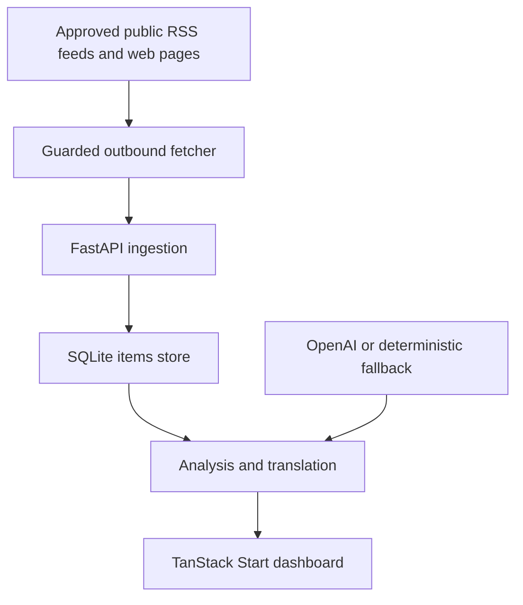

# Impact Atlas

Impact Atlas is an AI-assisted intelligence dashboard for small NGO teams. It collects RSS and web content, filters it against NGO priorities, identifies possible funding opportunities, translates relevant items, and produces an action-oriented briefing.

The repository is named `ngo-intelligence-dashboard`; **Impact Atlas** is the current frontend product name.

> **Project status:** Hackathon MVP. The application is suitable for local evaluation and controlled demonstrations. It is not production-ready: it has no authentication, no rate limiting, and no multi-user production data store.

> **Live demo:** No active public deployment has been verified. Do not publish a demo URL until its ownership, backend connectivity, data persistence, and security have been checked.

## Why it exists

Small NGO teams often monitor many fragmented sources with limited time. This project turns that manual scan into one workflow:

1. ingest RSS feeds or selected web pages;
2. store and deduplicate source material;
3. classify and rank items for specific NGO priorities;
4. surface funding leads, deadlines, and recommended actions;
5. translate priority content; and
6. generate a concise daily briefing.

The MVP was built as a team project for an AI-for-good hackathon and is currently tailored to the interests of Burundi Kids and WTG.

## What works

- RSS/Atom ingestion with duplicate detection
- targeted web scraping with optional `robots.txt` checks
- keyword search, filtering, pagination, and item detail views
- NGO-specific classification and 0–100 relevance scoring
- funding-opportunity and deadline detection
- English, French, and German translation
- digest generation with priorities, actions, and risk alerts
- optional OpenAI analysis through the Responses API
- deterministic analysis plus a clearly marked local translation preview
- React/TanStack Start frontend and FastAPI backend
- guarded outbound HTTP fetching for RSS and web ingestion
- SQLite persistence, automated backend tests, Docker packaging, and AWS Amplify frontend configuration
- pinned runtimes, hash-locked Python dependencies, npm lockfile installs, and GitHub Actions validation

## Demo boundaries

Several screens resemble a multi-user product but currently run only as frontend demonstrations:

| Feature | Current source of truth | Durable? |
|---|---|---|
| Ingested items, analysis, digest, stored translation | FastAPI and SQLite | Yes, subject to `DATABASE_PATH` |
| Login and signup | frontend demo action | No account is created |
| NGO profile | browser `localStorage` | Only in that browser profile |
| Saved and ignored signals | React memory | No |
| Peer profiles and conversations | static demo data and React memory | No |
| Onboarding recommendations | deterministic frontend mock | No |

The login screen does not validate credentials, signup does not create an account, and peer chat does not contact another organization. A configured demo profile only changes frontend presentation. Backend ranking, categories, recommendations, and fixtures remain tailored to Burundi Kids and WTG; a custom profile is not sent to the backend. The UI labels these boundaries, but the demo flows must be replaced with real services before the product is presented as multi-user software.

## System overview



For component boundaries, data flow, and trade-offs, see [Architecture](docs/ARCHITECTURE.md).

## Technology

| Layer | Technology |
|---|---|
| Frontend | React 19, TanStack Start/Router, Vite, TypeScript, Tailwind CSS |
| Backend | Python, FastAPI, Pydantic, Uvicorn |
| Storage | SQLite |
| Ingestion | feedparser, Requests, Beautiful Soup, langdetect |
| AI | OpenAI Python SDK with deterministic fallback logic |
| Packaging | Docker, AWS Amplify build configuration |
| Tests | pytest and FastAPI TestClient |

## Quick start

### Prerequisites

- Python 3.12.13, recorded in `.python-version`
- Node.js 24.14.0, recorded in `frontend/.nvmrc`
- npm 11.9.0, recorded in `frontend/package.json`

### 1. Configure and start the backend

From the repository root:

```bash
python -m venv .venv
```

Activate the environment:

```powershell
# Windows PowerShell
.\.venv\Scripts\Activate.ps1
```

```bash
# macOS or Linux
source .venv/bin/activate
```

Install the hash-locked runtime dependencies and create the local configuration:

```bash
python -m pip install --require-hashes -r requirements.txt
```

```powershell
# Windows PowerShell
Copy-Item .env.example .env
```

```bash
# macOS or Linux
cp .env.example .env
```

The application works without an API key when `AI_PROVIDER=none`. To enable OpenAI-backed analysis and translation, set `AI_PROVIDER=openai` and add your own `OPENAI_API_KEY` in `.env`.

Translation uses OpenAI only when it is explicitly configured. Without OpenAI, the API returns clearly marked preview text and does not send the text to another translation service.

The example environment enables the destructive demo helpers for local use. `POST /demo/reset` and `POST /demo/run` are available only when `ENABLE_DEMO_ENDPOINTS=true` and `APP_ENV` is explicitly `dev`, `development`, `local`, or `test`. Missing, staging, production, and unrecognized environments fail closed with `404`.

Start the API from the repository root:

```bash
uvicorn backend.main:app --reload
```

Verify it at <http://127.0.0.1:8000/health> or open the interactive API documentation at <http://127.0.0.1:8000/docs>.

### 2. Start the frontend

In a second terminal:

```bash
cd frontend
npm ci
npm run dev
```

Open the URL printed by Vite, normally <http://127.0.0.1:5173>. The root route is the public demo landing page. Enter the default demo workspace or configure a browser-local demo profile. During local development, the frontend uses `http://127.0.0.1:8000` unless `VITE_API_BASE_URL` is set.

Useful routes:

- `/app/inbox` — signal inbox
- `/app/dashboard` — backend operations dashboard
- `/app/saved` — temporary saved items
- `/app/chat` — demo peer conversations
- `/app/profile` — browser-local demo profile

## Demo workflow

1. Copy `.env.example` to `.env`, start both services, and open the landing page.
2. Enter the demo workspace and open **Dashboard**.
3. In the local development frontend, select **Load Local Demo Data** to replace the current SQLite items with five fixed demo records and analyze them.
4. Review the signal inbox. It identifies whether it is showing backend data or demo fixtures and displays backend-loading errors instead of silently presenting fallback data as live.
5. Open a signal to inspect the source, relevance reason, recommended action, and any funding deadline.
6. Translate it into English, French, or German. Without an enabled translation provider, the result is explicitly labelled as a local preview rather than a successful translation.
7. Review the briefing, which is refreshed with the dashboard data.

**Load Local Demo Data** calls `POST /demo/reset` with the required `replace-all-items` JSON confirmation. This control is hidden in production builds unless `VITE_ENABLE_DEMO_CONTROLS=true`; the backend still requires an explicit local/test environment. The endpoint **deletes all existing items** from the configured database and replaces them with demo records. It returns `404` when the local demo helpers are disabled. Use it only with a disposable demo database.

## API at a glance

| Method | Path | Purpose |
|---|---|---|
| `GET` | `/health` | Report API, AI-provider, and database status |
| `POST` | `/ingest/rss` | Ingest default or supplied RSS/Atom feeds |
| `POST` | `/ingest/web` | Scrape default or supplied web pages |
| `GET` | `/items` | Search, filter, and paginate stored items |
| `GET` | `/items/{id}` | Retrieve one item |
| `GET` | `/funding` | List likely funding opportunities |
| `POST` | `/analyze/{id}` | Analyze one item |
| `POST` | `/analyze/all` | Analyze a batch of recent items |
| `POST` | `/translate/{id}` | Translate a stored item |
| `POST` | `/translate/text` | Translate arbitrary text |
| `GET` | `/digest` | Generate the current NGO briefing |
| `POST` | `/demo/reset` | Replace stored data with the demo dataset when local demo helpers are enabled |
| `POST` | `/demo/run` | Run ingestion, scraping, analysis, and digest generation when local demo helpers are enabled |

Request and response details are documented in [API reference](docs/API.md).

## Validation

Install the development lock and run the backend tests from the repository root:

```bash
python -m pip install --require-hashes -r requirements-dev.txt
python -m pytest -q tests
```

Check the frontend from `frontend/`:

```bash
npm run lint
npm run typecheck
npm run build
npm run preview
```

`npm run preview` serves the Nitro production build for a local smoke test. GitHub Actions runs dependency checks, backend tests, frontend lint, typecheck, and build checks for pull requests and pushes to `master`.

## Deployment

- `Dockerfile` packages the FastAPI backend.
- `amplify.yml` builds the frontend for AWS Amplify.
- the deployed frontend should use `/api`, with `BACKEND_ORIGIN` pointing its server-side proxy to the public FastAPI origin.
- the Docker image defaults to `DATABASE_PATH=/tmp/items.db`; this is ephemeral and must be replaced with persistent storage for any durable deployment.
- every production backend must set `APP_ENV=production`, keep `ENABLE_DEMO_ENDPOINTS=false`, and provide an exact-hostname `SOURCE_DOMAIN_ALLOWLIST`.

See [Deployment](docs/DEPLOYMENT.md) before publishing either service.

## Important limitations

- There is no authentication, authorization, tenant isolation, or rate limiting.
- SQLite and the current schema are intended for a single small deployment.
- AI classifications, deadlines, translations, and recommended actions can be wrong and require human verification.
- Translation sends text to OpenAI only when OpenAI is configured; otherwise the API returns marked local preview text without calling another translation service.
- Scraping depends on third-party availability, page structure, terms, and robots policies.
- Caller-provided source URLs are restricted to public HTTP(S) destinations, ports 80/443, size-limited responses, and validated redirects. Production additionally requires an exact-hostname allowlist. Connect/read timeouts are inactivity limits, not a guaranteed whole-request deadline. Because validation and connection-time DNS resolution are separate, a DNS-rebinding race is still possible; enforce a network egress firewall that blocks private, link-local, loopback, multicast, reserved, and metadata ranges and applies an overall request deadline.
- The fallback analyzer is keyword-based; it is resilient for demos, not an accuracy benchmark.
- There is no scheduled ingestion, alert delivery, audit log, or review workflow.
- Demo profiles are browser-local and are not accounts. Saved/ignored items and conversations remain temporary frontend state.

> **Credential action required:** Repository review found what appears to be an OpenAI API key in historical Git data. Its value is intentionally not reproduced here. The repository owner must revoke and rotate it; deleting a key from the current tree does not make a historical credential safe.

Read [Security](SECURITY.md) before using real organizational data.

## Documentation

- [Architecture](docs/ARCHITECTURE.md)
- [API reference](docs/API.md)
- [Deployment](docs/DEPLOYMENT.md)
- [Contributing](CONTRIBUTING.md)
- [Security](SECURITY.md)
- [Implemented MVP summary](FINAL_REQUIREMENTS.md)

## License

No open-source license has been selected. Do not assume permission to copy, modify, or redistribute this repository until the maintainers add an explicit license.
