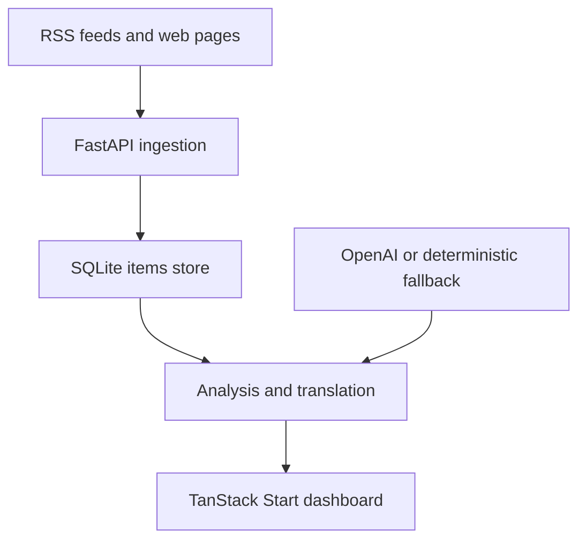

# Impact Atlas

Impact Atlas is an AI-assisted intelligence dashboard for small NGO teams. It collects RSS and web content, filters it against NGO priorities, identifies possible funding opportunities, translates relevant items, and produces an action-oriented briefing.

The repository is named `ngo-intelligence-dashboard`; **Impact Atlas** is the current frontend product name.

> **Project status:** Hackathon MVP. The application is suitable for local evaluation and controlled demonstrations. It is not production-ready: it has no authentication, no rate limiting, and no production data store.

> **Live demo:** No active public deployment has been verified. Do not publish a demo URL until its ownership, backend connectivity, data persistence, and security have been checked.

## Why it exists

Small NGO teams often monitor many fragmented sources with limited time. This project turns that manual scan into one workflow:

1. ingest RSS feeds or selected web pages;
2. store and deduplicate source material;
3. classify and rank items for specific NGO priorities;
4. surface funding leads, deadlines, and recommended actions;
5. translate priority content; and
6. generate a concise daily briefing.

The MVP was built as a team project for an AI-for-good hackathon and is currently tailored to the interests of Burundi Kids and WTG.

## What works

- RSS/Atom ingestion with duplicate detection
- targeted web scraping with optional `robots.txt` checks
- keyword search, filtering, pagination, and item detail views
- NGO-specific classification and 0–100 relevance scoring
- funding-opportunity and deadline detection
- English, French, and German translation
- digest generation with priorities, actions, and risk alerts
- optional OpenAI analysis through the Responses API
- deterministic analysis plus translation-provider/preview fallbacks for demos
- React/TanStack Start frontend and FastAPI backend
- SQLite persistence, automated backend tests, Docker packaging, and AWS Amplify frontend configuration

## Demo boundaries

Several screens resemble a multi-user product but currently run only as frontend demonstrations:

| Feature | Current source of truth | Durable? |
|---|---|---|
| Ingested items, analysis, digest, stored translation | FastAPI and SQLite | Yes, subject to `DATABASE_PATH` |
| Login and signup | frontend demo action | No |
| NGO profile | React memory | No |
| Saved and ignored signals | React memory | No |
| Peer profiles and conversations | static demo data and React memory | No |
| Onboarding recommendations | deterministic frontend mock | No |

The login form does not validate credentials, signup does not create an account, and peer chat does not contact another organization. These flows must be labelled as demo-only or replaced with real backend services before the product is presented as multi-user software.

## System overview



For component boundaries, data flow, and trade-offs, see [Architecture](docs/ARCHITECTURE.md).

## Technology

| Layer | Technology |
|---|---|
| Frontend | React 19, TanStack Start/Router, Vite, TypeScript, Tailwind CSS |
| Backend | Python, FastAPI, Pydantic, Uvicorn |
| Storage | SQLite |
| Ingestion | feedparser, Requests, Beautiful Soup, langdetect |
| AI | OpenAI Python SDK with deterministic fallback logic |
| Packaging | Docker, AWS Amplify build configuration |
| Tests | pytest and FastAPI TestClient |

## Quick start

### Prerequisites

- Python 3.12 (the container target)
- a current Node.js LTS release compatible with Vite 8, with npm

### 1. Configure and start the backend

From the repository root:

```bash
python -m venv .venv
```

Activate the environment:

```powershell
# Windows PowerShell
.\.venv\Scripts\Activate.ps1
```

```bash
# macOS or Linux
source .venv/bin/activate
```

Install dependencies and create the local configuration:

```bash
python -m pip install -r requirements.txt
```

```powershell
# Windows PowerShell
Copy-Item .env.example .env
```

```bash
# macOS or Linux
cp .env.example .env
```

The application works without an API key when `AI_PROVIDER=none`. To enable OpenAI-backed analysis and translation, set `AI_PROVIDER=openai` and add your own `OPENAI_API_KEY` in `.env`.

External translation fallback is disabled by default. Set `TRANSLATION_PROVIDER=google` only after approving that text may be sent to Google when OpenAI is unavailable.

Start the API from the repository root:

```bash
uvicorn backend.main:app --reload
```

Verify it at <http://127.0.0.1:8000/health> or open the interactive API documentation at <http://127.0.0.1:8000/docs>.

### 2. Start the frontend

In a second terminal:

```bash
cd frontend
npm ci
npm run dev
```

Open the URL printed by Vite, normally <http://127.0.0.1:5173>. The root route redirects to signup; choose the demo path or complete the in-memory onboarding flow. During local development, the frontend uses `http://127.0.0.1:8000` unless `VITE_API_BASE_URL` is set.

Useful routes:

- `/app/inbox` — signal inbox
- `/app/dashboard` — backend operations dashboard
- `/app/saved` — in-memory saved items
- `/app/chat` — demo peer conversations
- `/app/profile` — in-memory NGO profile

## Demo workflow

1. Open the dashboard.
2. Use **Update Feeds** to ingest RSS sources or **Search Web** to scrape the curated web sources.
3. Run the prioritization action to analyze stored items.
4. Review signals, funding leads, recommendations, and the digest.
5. Open an item and translate it into English, French, or German.

For a repeatable local demo, call `POST /demo/reset` before refreshing the dashboard. This endpoint **deletes all existing items** from the configured database and replaces them with demo records.

## API at a glance

| Method | Path | Purpose |
|---|---|---|
| `GET` | `/health` | Report API, AI-provider, and database status |
| `POST` | `/ingest/rss` | Ingest default or supplied RSS/Atom feeds |
| `POST` | `/ingest/web` | Scrape default or supplied web pages |
| `GET` | `/items` | Search, filter, and paginate stored items |
| `GET` | `/items/{id}` | Retrieve one item |
| `GET` | `/funding` | List likely funding opportunities |
| `POST` | `/analyze/{id}` | Analyze one item |
| `POST` | `/analyze/all` | Analyze a batch of recent items |
| `POST` | `/translate/{id}` | Translate a stored item |
| `POST` | `/translate/text` | Translate arbitrary text |
| `GET` | `/digest` | Generate the current NGO briefing |
| `POST` | `/demo/reset` | Replace stored data with the demo dataset |
| `POST` | `/demo/run` | Run ingestion, scraping, analysis, and digest generation |

Request and response details are documented in [API reference](docs/API.md).

## Validation

Run the backend tests from the repository root:

```bash
python -m pytest -q tests
```

Check the frontend from `frontend/`:

```bash
npm run lint
npm run build
```

These are the expected validation commands; a clean run depends on installing the declared Python and npm dependencies first.

## Deployment

- `Dockerfile` packages the FastAPI backend.
- `amplify.yml` builds the frontend for AWS Amplify.
- the deployed frontend should use `/api`, with `BACKEND_ORIGIN` pointing its server-side proxy to the public FastAPI origin.
- the Docker image defaults to `DATABASE_PATH=/tmp/items.db`; this is ephemeral and must be replaced with persistent storage for any durable deployment.

See [Deployment](docs/DEPLOYMENT.md) before publishing either service.

## Important limitations

- There is no authentication, authorization, tenant isolation, or rate limiting.
- SQLite and the current schema are intended for a single small deployment.
- AI classifications, deadlines, translations, and recommended actions can be wrong and require human verification.
- Translation sends text to OpenAI only when OpenAI is configured. An optional Google Translate fallback is used only when `TRANSLATION_PROVIDER=google`.
- Scraping depends on third-party availability, page structure, terms, and robots policies.
- The web-ingestion endpoint accepts caller-provided URLs and must not be exposed to untrusted users without additional network controls and URL validation.
- The fallback analyzer is keyword-based; it is resilient for demos, not an accuracy benchmark.
- There is no scheduled ingestion, alert delivery, audit log, or review workflow.
- Frontend profiles, saved items, and conversations disappear on reload.

Read [Security](SECURITY.md) before using real organizational data.

## Documentation

- [Architecture](docs/ARCHITECTURE.md)
- [API reference](docs/API.md)
- [Deployment](docs/DEPLOYMENT.md)
- [Contributing](CONTRIBUTING.md)
- [Security](SECURITY.md)
- [Implemented MVP summary](FINAL_REQUIREMENTS.md)

## License

No open-source license has been selected. Do not assume permission to copy, modify, or redistribute this repository until the maintainers add an explicit license.
