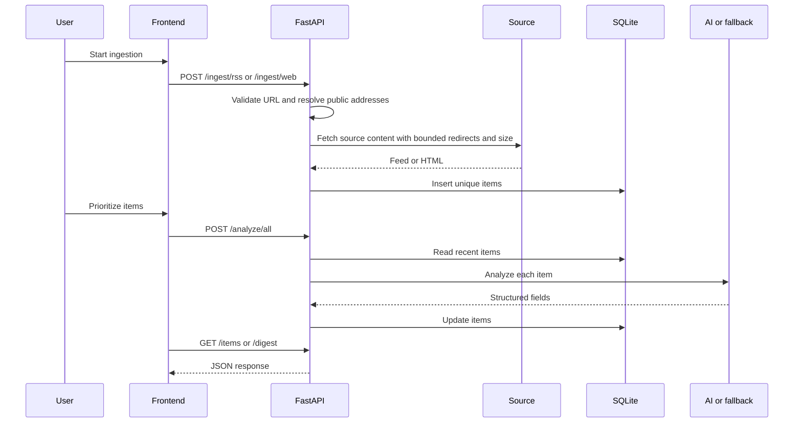
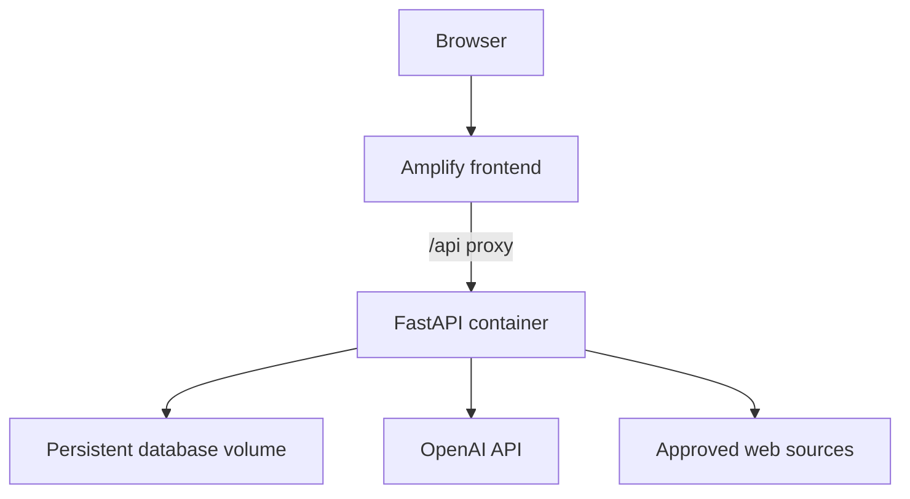

# Architecture

## Scope

Impact Atlas is a hackathon MVP with three runtime concerns:

- collect potentially relevant material from RSS feeds and web pages;
- turn stored material into structured NGO intelligence; and
- present results in a browser dashboard.

It is a modular monolith, not a distributed production system. The frontend and backend are deployed separately. Backend items and their analysis are stored in SQLite. Account, profile, saved-item, and chat experiences are frontend demonstrations: the demo profile is browser-local, while the other interaction state is in memory.

## Runtime components

| Component | Responsibility | Main implementation |
|---|---|---|
| Browser application | navigation, filters, actions, item views, translations, and briefings | `frontend/src/` |
| Frontend server | server-side rendering and optional same-origin `/api` proxy | `frontend/src/server.ts` |
| HTTP API | validation, routing, CORS, and orchestration | `backend/main.py` |
| Safe outbound client | public-destination validation, redirect validation, timeouts, content checks, and response-size limits | `backend/http_client.py` |
| RSS ingestion | feed retrieval, parsing, language detection, and deduplication | `backend/ingest_service.py` |
| Web ingestion | page retrieval, text extraction, link discovery, relevance filtering, and robots checks | `backend/web_scraper_service.py` |
| Analysis | item analysis, bulk analysis, translations, and digest assembly | `backend/analysis_service.py` |
| AI adapter | OpenAI structured-output calls plus deterministic fallbacks | `backend/ai_service.py` |
| Persistence | schema creation, migration helpers, filtering, and CRUD | `backend/database.py` |
| Domain models | API request/response validation and allowed values | `backend/models.py` |
| Demo state | browser-local profile plus volatile saved/ignored items and conversations | `frontend/src/lib/app-state.tsx` |
| Demo fixtures | static profiles, signals, and conversations | `frontend/src/lib/demo-data.ts` |

## Request and data flow

## Frontend

The frontend is a React 19 application built with TanStack Start/Router and Vite. `frontend/src/lib/api.ts` is the typed boundary to the backend.

API-origin resolution follows this order:

1. use `VITE_API_BASE_URL` when it is configured;
2. for local development, call `http://127.0.0.1:8000`;
3. on private-network hosts, call port `8000` on the same host; or
4. use same-origin `/api` in deployed environments.

The frontend server can forward `/api/*` to the origin configured by `BACKEND_ORIGIN`. It fails closed with `503` when that value is missing; API traffic is never sent to a built-in tunnel or third-party host.

The inbox distinguishes SQLite-backed results from static demo fixtures and surfaces backend-load errors. A failed backend request must not be presented as successful live data. **Load Local Demo Data** on the development dashboard deliberately invokes the guarded `POST /demo/reset` operation with its required confirmation phrase, then reloads the backend dashboard.

## Frontend state boundaries

| Feature | Source of truth | Persistence |
|---|---|---|
| Backend intelligence items | SQLite | database-dependent |
| Login/signup | demo UI only | no account |
| NGO profile | browser `localStorage` | one browser profile |
| Saved/ignored signals | React state | none |
| Peer conversations | static fixtures and React state | none |
| Onboarding recommendations | deterministic frontend mock | none |

The `/app` layout's profile check is a navigation guard, not authentication or authorization. The custom profile controls frontend labels and language only. It is not supplied to analysis, ingestion, ranking, or digest requests; those backend rules and the fixed demo records remain tailored to Burundi Kids and WTG.

## Backend

FastAPI initializes the SQLite schema during application startup. Route functions call service classes directly, and services use the database helpers directly. This is intentionally simple for a short-lived MVP.

The API allows local development origins, RFC1918 private-network origins, and `*.amplifyapp.com` through its current CORS regular expression. Additional origins can be supplied as a comma-separated `CORS_ORIGINS` value.

### Ingestion

RSS ingestion uses a small default feed list when the request supplies no feed URLs. Each item is mapped to a normalized record, and the database's unique URL index handles duplicates.

Web ingestion starts from curated pages unless the request supplies URLs. It can follow relevant same-domain links, safely retrieves `robots.txt`, filters low-value/listing pages, and stores readable text from pages that match the configured NGO themes.

RSS, page, and `robots.txt` requests share one guarded outbound client. It:

- accepts only HTTP(S), ports 80/443, URLs up to 2,048 characters, and URLs without credentials, backslashes, or control characters;
- resolves every fetch hostname and rejects the destination if any returned IPv4 or IPv6 address is private, loopback, link-local, multicast, reserved, unspecified, or otherwise non-global;
- requires an exact-hostname `SOURCE_DOMAIN_ALLOWLIST` in production;
- follows at most five redirects, validates every hop, rejects HTTPS-to-HTTP downgrade, and blocks cross-origin page redirects while robots enforcement is active;
- uses connect/read inactivity timeouts, disables environment proxy inheritance, checks expected content types, and limits response bodies to 2 MB.

These application checks reduce SSRF exposure but cannot pin the socket to the IP address that was validated. DNS can change between validation and the HTTP client's connection. Production infrastructure must therefore enforce an egress firewall that blocks loopback, private, link-local, multicast, reserved, unspecified, and cloud metadata destinations.

The read timeout is an inactivity timeout rather than a strict wall-clock deadline. A source that continuously drip-feeds data can occupy a worker longer than the timeout while remaining below the 2 MB cap. A production proxy or worker supervisor must enforce an overall request deadline.

### Analysis and fallbacks

When `AI_PROVIDER=openai` and the API key appears configured, the AI adapter requests strict JSON-shaped outputs for analysis, translation, and digests. Any provider exception currently falls back silently.

Without OpenAI, deterministic analysis logic:

- classifies items through theme keywords;
- calculates a bounded 0–100 relevance score;
- detects likely funding content;
- extracts simple date patterns;
- produces template-based explanations and actions; and
- produces template-based digest and analysis content.

Translation tries OpenAI when configured. If that path is unavailable, it returns clearly marked preview text without calling a secondary translation service. The dashboard identifies that output as a preview, not as translated content.

This behavior keeps the demo usable but also hides provider failures from callers. Production observability should distinguish provider errors, fallback use, and model-quality failures.

## Storage model

SQLite stores one `items` table. Important fields include:

- source: `title`, `url`, `source`, `published_at`, `language`, `raw_text`;
- analysis: `summary`, `category`, `relevance_score`, `is_funding_opportunity`, `deadline`;
- actionability: `target_org`, `why_relevant`, `recommended_action`;
- translation: `translated_text`, `translated_language`; and
- lifecycle: `created_at`, `updated_at`.

The URL is unique. Required source text fields reject empty values, and relevance scores are constrained to 0–100. Schema-initialization code includes a narrow migration path from an earlier category and score representation.

SQLite is appropriate for a local demo. It is not a substitute for concurrent, backed-up, multi-user production storage.

## Deployment topology

The intended hosted topology is:

The provided Dockerfile writes SQLite to `/tmp/items.db` by default. That path is ephemeral on most container platforms. A durable deployment must mount persistent storage or move to a managed relational database.

Production sets `APP_ENV=production`, which requires an outbound-source allowlist and keeps the demo operations unavailable even if `ENABLE_DEMO_ENDPOINTS` is mistakenly true. Demo operations require both the enable flag and an explicit `dev`, `development`, `local`, or `test` environment; missing, staging, and unrecognized values fail closed. The checked-in example environment explicitly opts in for local demonstrations.

Reproducibility boundaries are recorded in `.python-version`, `frontend/.nvmrc`, the npm `packageManager` field, `package-lock.json`, and hash-locked `requirements.txt`/`requirements-dev.txt`. The Docker image uses the same pinned Python runtime and runtime lock. GitHub Actions exercises dependency compatibility, backend tests, and frontend lint, typecheck, and build on pull requests and pushes to `master`.

## Trust boundaries and risks

- API requests are unauthenticated.
- caller-supplied source URLs cross a network trust boundary; application checks require defense in depth through an infrastructure egress firewall.
- scraped text and model output are untrusted content.
- model-generated funding deadlines and recommendations require source verification.
- third-party feeds and sites can change format, fail, or block access.
- the current fallback path prioritizes demo continuity over explicit error reporting.

See [Security](../SECURITY.md) and [Deployment](DEPLOYMENT.md) for operational controls.

## Evolution path

The next architectural steps should be driven by real usage, not added pre-emptively:

1. add authentication and organization-level authorization;
2. replace the environment allowlist with an administered source registry and egress policy;
3. move persistence to a managed database with migrations and backups;
4. run ingestion and analysis as observable background jobs;
5. add source provenance, reviewer decisions, and audit history;
6. evaluate relevance, deadline extraction, and translation against a labelled test set; and
7. extend the current CI with deployment promotion, secret scanning, automated dependency updates, and structured monitoring.
